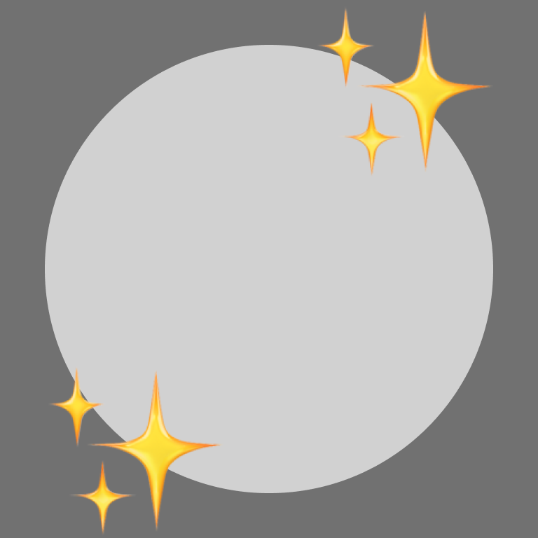
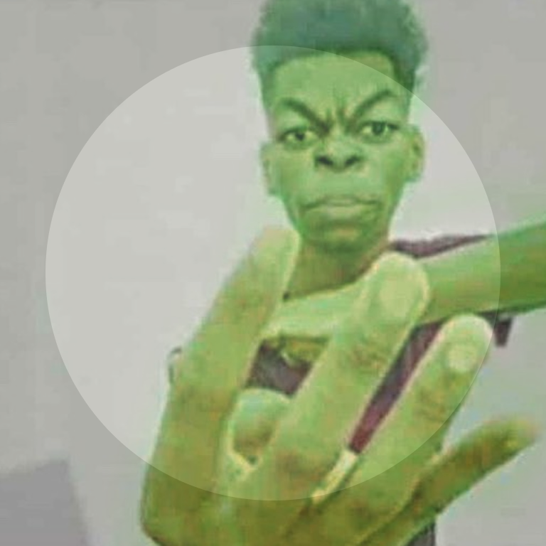

# Guidelines

## Decoration Rules

1. No pornography, gore, etc (No NSFW). **Violating this rule will result in you being banned from creating new decorations.**
2. No excessive flashing.
3. No political content.
4. Any text must be in English.
5. **No re-uploaded Discord decorations.**
6. **Must be decorative, not just a random image.**
   - Must take advantage of the additional space provided by the avatar decoration without majorly obscuring the avatar itself.
   - Decorations that consist of a random image in the corner of the avatar decoration are low quality/effort and will not be accepted. 
7. The Decor team reserves the right to deny decorations for any reason.
8. The Decor team also reserves the right to prevent you from creating decorations for violating the aforementioned rules.

### Examples
| Good decoration | Bad decoration |
| --------------- | -------------- |
|  |  |
| This decoration would pass review as it is decorative and does not fully obscure the avatar. | This decoration would not pass review as it fully obscures the avatar and is not decorative. |

## Decoration Specification

Decorations are (A)PNG images that are square and 1.2x the size of your avatar. For example, a 640x640 circle in a 768x768 square would be a accurate decoration base.

**[Get the template](https://raw.githubusercontent.com/decor-discord/.github/main/assets/template.png)**

Decorations have a maximum resolution of 768x768, and the server will resize oversized submissions to this size.

Animated decorations will be split out into two files, A PNG of the first frame and the other being the full file (minus the first frame in the case of a APNG with a skipped first frame).

## Process

You can create your decoration using any client mod with a Decor plugin capable of creating decorations.

After creating it, you won't be able to use it until it is manually reviewed by a reviewer.

Please do not harass reviewers to review your decoration.

After your decoration is reviewed, if approved, it will be selected as your active decoration. Otherwise, it will be deleted.

Interested in creating a preset of decorations for anyone to use? Check the `#faq` channel in the [Discord Server][invite].

[invite]: https://discord.gg/dXp2SdxDcP
